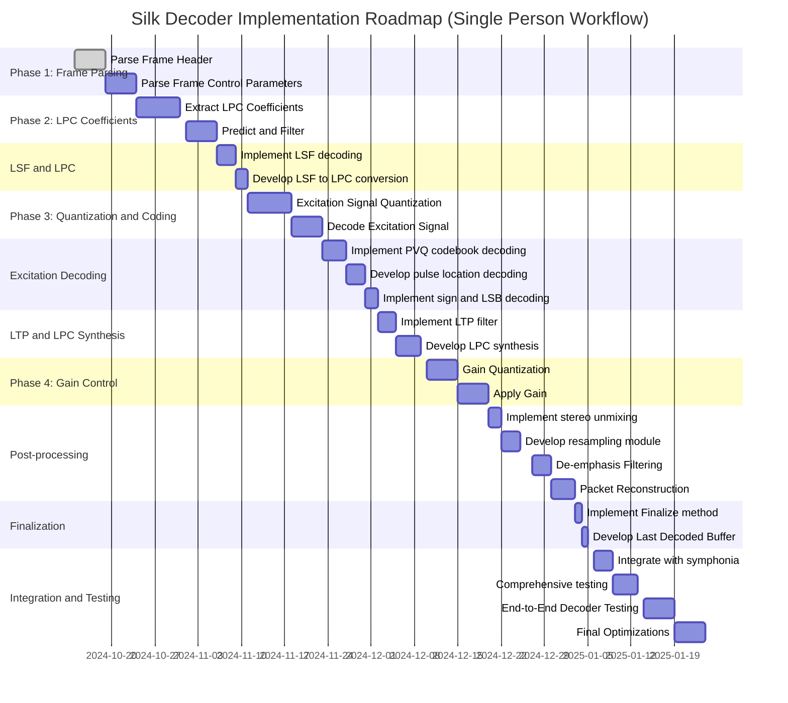

# Symphonia Opus Codec

This is a SILK-focused Opus decoder as an addition to the [Symphonia project](https://github.com/pdeljanov/Symphonia) 
offering a pure-Rust implementation of the Opus audio codec, designed for decoding audio stream.
The Opus codec handles a wide range of audio applications, and this module focuses on implementing the Opus decoder, with plans to support all modes (SILK, CELT, and Hybrid) as described in the [Opus specification](https://datatracker.ietf.org/doc/html/rfc6716).

**Note:** This crate is part of Symphonia. Please use the [`symphonia`](https://crates.io/crates/symphonia) crate
instead of this one directly.
---


## 🏗 **Project Structure**
```sourcegraph
/symphonia/symphonia-codec-opus
├── Cargo.toml
├── README.md
├── src
│   ├── decoder.rs      # Main Opus decoder implementation (SILK Mode)
│   ├── entropy.rs      # Entropy decoding using range coding
│   ├── header.rs       # Handles Opus headers
│   ├── lib.rs          # Library entry point
│   ├── packet.rs       # Packet processing
│   ├── toc.rs          # Handles TOC byte processing
│   └── silk            # SILK decoder components
│       ├── decoder.rs  # SILK decoder (prototype)
│       ├── error.rs    # SILK-specific error handling
|       └── constant.rs # codebooks, tables, pdfs, etc.
└── tests               # Unit tests for each component
```
---
## 📜 **Features Overview**

| Feature                 | Status         | Notes                                                             |
|-------------------------|----------------|-------------------------------------------------------------------|
| **SILK Decoder**        | 🟡 Prototype   | Draft that needs refactoring and testing. Handles speech streams. |
| **CELT Decoder**        | 🔴 Missing     | Placeholder. Needed for high-quality music decoding.              |
| **Hybrid Decoder**      | 🔴 Missing     | Placeholder. Needed for mixed music and speech decoding.          |
| **Range Coding**        | 🟢 Implemented | Based on RFC 6716, tested and working.                            |
| **Packet Handling**     | 🟢 Implemented | Basic packet parsing and processing is working fine.              |
| **Finalize Method**     | 🔴 Missing     | Required to free resources after decoding completes.              |
| **Last Decoded Buffer** | 🔴 Missing     | Needs implementation to return the last decoded audio buffer.     |

---
## 🛠 **Roadmap**


## License

Symphonia is provided under the MPL v2.0 license. Please refer to the LICENSE file for more details.


## Contributing

Symphonia is a free and open-source project that welcomes contributions! To get started, please read
our [Contribution Guidelines](https://github.com/pdeljanov/Symphonia/tree/master/CONTRIBUTING.md).
