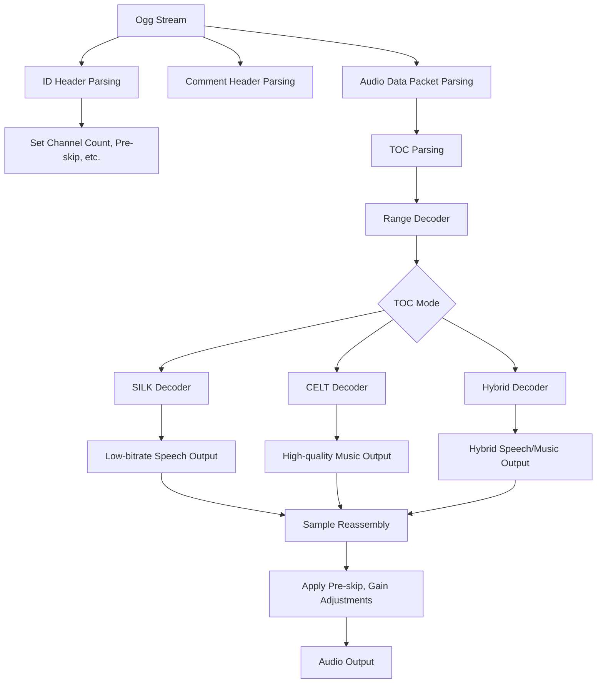

# Symphonia Opus Codec

This is a SILK-focused Opus decoder as an addition to the Symphonia project

**Note:** This crate is part of Symphonia. Please use the [`symphonia`](https://crates.io/crates/symphonia) crate instead of this one directly.

## Module Structure
```
symphonia-codec-opus/
├── Cargo.toml
├── README.md
└── src/
    ├── lib.rs                 # Main library file, implements Symphonia's Codec trait
    ├── decoder.rs             # Top-level Opus decoder structure
    ├── header.rs              # Opus header parsing
    ├── errors.rs              # Opus-specific error types
    ├── silk/
    │   ├── mod.rs             # SILK module entry point
    │   ├── decoder.rs         # Main SILK decoding logic
    │   ├── lpc.rs             # Linear Predictive Coding
    │   ├── nlsf.rs            # Noise-Like Synthesized Frequency decoding
    │   ├── pitch.rs           # Pitch analysis and filtering
    │   ├── range_coder.rs     # Range decoder implementation
    │   └── resampler.rs       # Resampler for SILK
    ├── celt/
    │   └── mod.rs             # Placeholder for future CELT implementation
    └── utils/
        ├── mod.rs             # Utility functions entry point
        └── bitstream.rs       # Bitstream reading utilities
```

## Limitations 
This approach will only work for Opus streams that exclusively use SILK mode. It won't be able to decode streams that use CELT or Hybrid modes, which are common in music or full-bandwidth audio applications.

## Future Expansion: 
There is a plan for future improvements, which could involve adding CELT support later to create a full Opus decoder.

## License

Symphonia is provided under the MPL v2.0 license. Please refer to the LICENSE file for more details.

## Contributing

Symphonia is a free and open-source project that welcomes contributions! To get started, please read our [Contribution Guidelines](https://github.com/pdeljanov/Symphonia/tree/master/CONTRIBUTING.md).

## Flowchart
