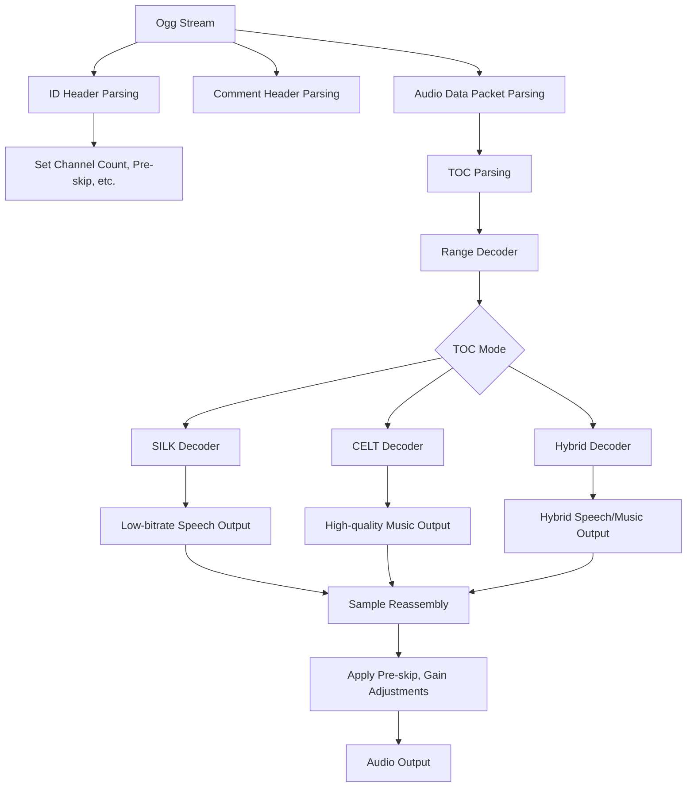

# Symphonia Opus Codec

This is a SILK-focused Opus decoder as an addition to the Symphonia project

**Note:** This crate is part of Symphonia. Please use the [`symphonia`](https://crates.io/crates/symphonia) crate
instead of this one directly.

## Module Structure

```
symphonia-codec-opus/
├── Cargo.toml
├── README.md
└── src/
```

## Limitations

This approach will only work for Opus streams that exclusively use SILK mode. It won't be able to decode streams that
use CELT or Hybrid modes, which are common in music or full-bandwidth audio applications.

## Future Expansion:

There is a plan for future improvements, which could involve adding CELT support later to create a full Opus decoder.

## Codec integration

Symphonia uses a modular approach where demuxers handle container formats (e.g., OGG) and pass compressed audio streams
to decoders. The role of symphonia-codec-opus crate will be strictly limited to decoding Opus-encoded audio
streams. Container-level operations such as OGG demuxing is already handled by the existing demuxers like symphonia-format-ogg.

`CodecParameters` is a key structure in Symphonia used to pass audio stream metadata. In `symphonia-format-ogg` crate
the demuxer extracts and passes metadata from the Ogg container to the Opus decoder via `CodecParameters`.

## Packet parsing and decoding

Opus packet structure and frame sizes are well-documented in [RFC 6716](https://datatracker.ietf.org/doc/html/rfc6716)
and [RFC 7587](https://datatracker.ietf.org/doc/html/rfc7845).
The decoding process involves:

* Extracting frames from the Opus packet (with variable-length frame packing).
* Handling different frame durations (2.5, 5, 10, 20 ms) as described in the RFC.
* Decoding frames based on the SILK (for low bitrates) or CELT (for high bitrates) hybrid mode that uses both.
* Using Opus’s range decoder to interpret symbols packed into each frame, particularly for audio bandwidth and
  prediction settings.
 
## Roadmap

## Flowchart



## License

Symphonia is provided under the MPL v2.0 license. Please refer to the LICENSE file for more details.

## Contributing

Symphonia is a free and open-source project that welcomes contributions! To get started, please read
our [Contribution Guidelines](https://github.com/pdeljanov/Symphonia/tree/master/CONTRIBUTING.md).
