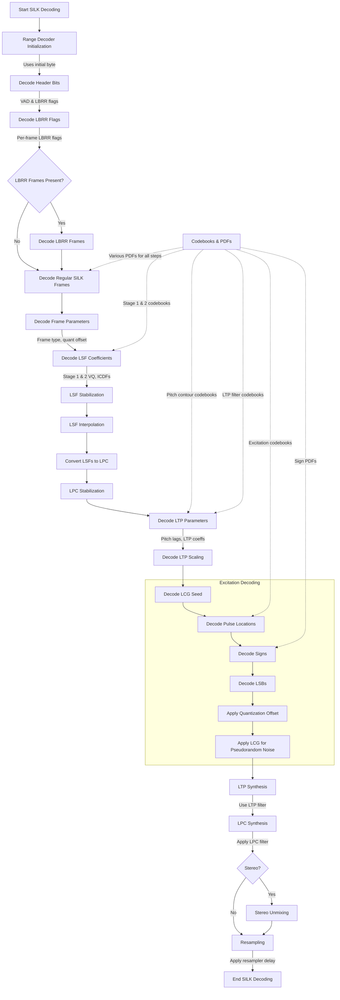

# Symphonia Opus Codec: SILK Decoder Implementation in Rust

## Introduction

This presentation delves into the Opus audio decoder, focusing on its structure, 
frame packing, decoding process, as specified in RFC 7845 and RFC 6716. 

## Overview of the Opus Codec

Opus is a versatile audio codec standardized by the IETF in RFC 6716. It's designed for interactive speech and music transmission over the Internet, combining two technologies:

1. **SILK**: Optimized for speech coding.
2. **CELT** (Constrained Energy Lapped Transform): Optimized for music and generic audio.

The codec dynamically switches between SILK, CELT, or a hybrid mode, depending on the content and bitrate.

### Packet Organization for a Logical Ogg Opus Stream
```
        Page 0         Pages 1 ... n        Pages (n+1) ...
     +------------+ +---+ +---+ ... +---+ +-----------+ +---------+ +--
     |            | |   | |   |     |   | |           | |         | |
     |+----------+| |+-----------------+| |+-------------------+ +-----
     |||ID Header|| ||  Comment Header || ||Audio Data Packet 1| | ...
     |+----------+| |+-----------------+| |+-------------------+ +-----
     |            | |   | |   |     |   | |           | |         | |
     +------------+ +---+ +---+ ... +---+ +-----------+ +---------+ +--
     ^      ^                           ^
     |      |                           |
     |      |                           Mandatory Page Break
     |      |
     |      ID header is contained on a single page
     |
     'Beginning Of Stream'
```

## Opus Packet Structure

Each Opus packet consists of:

```
+----------+--------------+---------+
| TOC Byte | Frame Packet | Padding |
+----------+--------------+---------+
```

- **TOC Byte**: Table of Contents byte indicating mode, bandwidth, and frame count.
- **Frame Packet**: Contains one or more frames.
- **Padding**: Optional padding for alignment.

### TOC Byte Structure

```
  0 1 2 3 4 5 6 7
 +-+-+-+-+-+-+-+-+
 | config |s| c  |
 +-+-+-+-+-+-+-+-+
```

- **config** (bits 0-4): Encodes audio bandwidth, frame size, and mode (SILK, CELT, or Hybrid).
- **s** (bit 5): Stereo flag (0 for mono, 1 for stereo).
- **c** (bits 6-7): Frame count code.


## Opus Decoder

The Opus decoder consists of two main blocks: the SILK decoder and
the CELT decoder.  At any given time, one or both of the SILK and
CELT decoders may be active.  The output of the Opus decode is the
sum of the outputs from the SILK and CELT decoders with proper sample
rate conversion and delay compensation on the SILK side, and optional
decimation (when decoding to sample rates less than 48 kHz) on the
CELT side, as illustrated in the block diagram below.
```
                            +---------+    +------------+
                            |  SILK   |    |   Sample   |
                         +->| Decoder |--->|    Rate    |----+
   Bit-    +---------+   |  |         |    | Conversion |    v
   stream  |  Range  |---+  +---------+    +------------+  /---\  Audio
   ------->| Decoder |                                     | + |------>
           |         |---+  +---------+    +------------+  \---/
           +---------+   |  |  CELT   |    | Decimation |    ^
                         +->| Decoder |--->| (Optional) |----+
                            |         |    |            |
                            +---------+    +------------+

```

## Silk Decoder
**SILK** is a speech codec developed by Skype, designed for efficient voice compression.
In Opus, SILK handles the low-frequency (narrowband to wideband) speech signals 
using linear predictive coding (LPC) techniques.


### SILK Decoder Structure

### 6.2 SILK Decoder Structure

The SILK decoder reconstructs the audio signal from the encoded bitstream using several processing modules.

```
        +---------+    +------------+
     -->| Range   |--->| Decode     |---------------------------+
      1 | Decoder | 2  | Parameters |----------+       5        |
        +---------+    +------------+     4    |                |
                            3 |                |                |
                             \/               \/               \/
                       +------------+   +------------+   +------------+
                       | Generate   |-->| LTP        |-->| LPC        |
                       | Excitation |   | Synthesis  |   | Synthesis  |
                       +------------+   +------------+   +------------+
                                               ^                |
                                               |                |
                           +-------------------+----------------+
                           |                                      6
                           |   +------------+   +-------------+
                           +-->| Stereo     |-->| Sample Rate |-->
                               | Unmixing   | 7 | Conversion  | 8
                               +------------+   +-------------++
```
1: Range encoded bitstream
2: Coded parameters
3: Pulses, LSBs, and signs
4: Pitch lags, Long-Term Prediction (LTP) coefficients
5: Linear Predictive Coding (LPC) coefficients and gains
6: Decoded signal (mono or mid-side stereo)
7: Unmixed signal (mono or left-right stereo)
8: Resampled signal

### Range Decoder
A range decoder is an algorithm used for entropy decoding, which is the process of reconstructing compressed data back to its original form.
It efficiently decodes a stream of bits into symbols based on probabilistic models. It's a practical implementation of arithmetic decoding.

Each symbol coded by the range coder is drawn from a finite alphabet and coded in a separate "context", which describes the size of the
alphabet and the relative frequency of each symbol in that alphabet.

### **Role in the Opus Codec**

- In the Opus codec, especially in the SILK layer, many parameters (like LSF indices, LTP coefficients, and excitation pulses) are encoded using entropy coding.
- These symbols are decoded using specific probability distributions, which are predefined or adaptively calculated.
- Using a range decoder allows for efficient handling of these probability models, ensuring that the decoding process is both fast and accurate.

### **How Does the Range Decoder Work?**

1. **Initialization**: The decoder starts with a range representing the entire possible interval (e.g., [0, 1)).
2. **Symbol Decoding**:
    - For each symbol, the range is narrowed based on the cumulative probability distribution of the symbol.
    - The decoder reads bits from the input stream to determine where within the current range the next symbol falls.
3. **Updating the Range**:
    - The process repeats, updating the range for each subsequent symbol based on the probabilities.
    - This continues until all symbols are decoded.

**CDF Usage**:
    - The CDF represents the probability model for the symbol.
    - It's essential for mapping the input bits to the correct symbol based on the probabilities.

### **Importance in Decoding Frame Parameters and Excitation Signal**

- **Frame Parameters**:
    - Parameters like gain indices, LSF coefficients, and pitch lags are entropy-coded.
    - Accurate decoding of these parameters is crucial for reconstructing the audio signal.
- **Excitation Signal**:
    - The excitation signal drives the synthesis filter in the SILK decoder.
    - It's encoded using pulse coding techniques that rely on entropy coding for efficiency.

### SILK Layer 

```
  +----------------------------------+
  |           Header Bits            |
  | +------------------------------+ |
  | |    VAD flag (1 bit/frame)    | |
  | +------------------------------+ |
  | |        LBRR flag (1 bit)     | |
  | +------------------------------+ |
  +----------------------------------+
  |      Per-Frame LBRR Flags        |
  |          (optional)              |
  +----------------------------------+
  |        LBRR Frames               |
  |          (optional)              |
  | +------------------------------+ |
  | |        LBRR Frame 1          | |
  | +------------------------------+ |
  | |        LBRR Frame 2          | |
  | +------------------------------+ |
  | |        LBRR Frame 3          | |
  | +------------------------------+ |
  +----------------------------------+
  |         Regular SILK Frame       |
  | +------------------------------+ |
  | |        Frame Type            | |
  | +------------------------------+ |
  | |     Quantization Gains       | |
  | +------------------------------+ |
  | | Normalized LSF Stage1 Index  | |
  | +------------------------------+ |
  | |Normalized LSF Stage2 Residual| |
  | +------------------------------+ |
  | |   LSF Interpolation Weight   | |
  | |      (optional, 20 ms)       | |
  | +------------------------------+ |
  | |    Primary Pitch Lag         | |
  | |    (optional, voiced)        | |
  | +------------------------------+ |
  | | Subframe Pitch Contour       | |
  | |      (optional, voiced)      | |
  | +------------------------------+ |
  | |    Periodicity Index         | |
  | |    (optional, voiced)        | |
  | +------------------------------+ |
  | |      LTP Filter Coeffs       | |
  | |    (optional, voiced)        | |
  | +------------------------------+ |
  | |       LTP Scaling            | |
  | |    (optional, conditional)   | |
  | +------------------------------+ |
  | |         LCG Seed             | |
  | +------------------------------+ |
  | |    Excitation Rate Level     | |
  | +------------------------------+ |
  | |   Excitation Pulse Counts    | |
  | +------------------------------+ |
  | |  Excitation Pulse Locations  | |
  | +------------------------------+ |
  | |      Excitation LSBs         | |
  | +------------------------------+ |
  | |     Excitation Signs         | |
  | +------------------------------+ |
  +----------------------------------+
```

## SILK Decoding Process

These three components work together to provide efficient compression while maintaining high audio quality:
1. LSFs provide a stable and efficient way to encode the spectral envelope across frames.
2. LTP reduces the residual signal energy for periodic sounds like voiced speech.
3. LPC further reduces the residual signal by removing short-term correlations.

LSF (Line Spectral Frequencies):
    - What: LSFs are a representation of Linear Prediction Coefficients (LPC) in the frequency domain.
    - Why needed:
      a. They provide a stable and efficient way to quantize the spectral envelope of the signal.
      b. LSFs have good interpolation properties, allowing smooth transitions between frames.
      c. They're less sensitive to quantization errors than direct LPC coefficients.

LTP (Long-Term Prediction):
    - What: LTP models the long-term correlations in the signal, particularly the pitch periodicity in voiced speech.
    - Why needed:
      a. It significantly reduces the required bitrate for periodic signals like voiced speech.
      b. LTP allows the codec to adapt to changing pitch periods in the signal.
      c. In SILK, a 5-tap LTP filter is used per subframe, providing fine-grained pitch prediction.

LPC (Linear Predictive Coding):
    - What: LPC models the spectral envelope of the signal using a short-term prediction filter.
    - Why needed:
      a. It provides an efficient representation of the formant structure of speech.
      b. LPC reduces short-term redundancies in the signal, leading to more efficient coding.
      c. It allows the codec to adapt to the changing spectral characteristics of the input signal.

## Conclusion

Implementing the SILK decoder in Rust for the Symphonia project requires careful attention to the specifications in RFC 6716. The decoder's structure, frame packing methods, and mathematical foundations are crucial for achieving high-quality audio reproduction at low bitrates.

## References

- RFC 6716: [Definition of the Opus Audio Codec](https://datatracker.ietf.org/doc/html/rfc6716)
- Symphonia Project: [GitHub Repository](https://github.com/pdeljanov/Symphonia)
- Opus Codec: [Official Website](https://opus-codec.org)